# 數位人對話系統 - 完整流程圖

## 1. 系統初始化流程

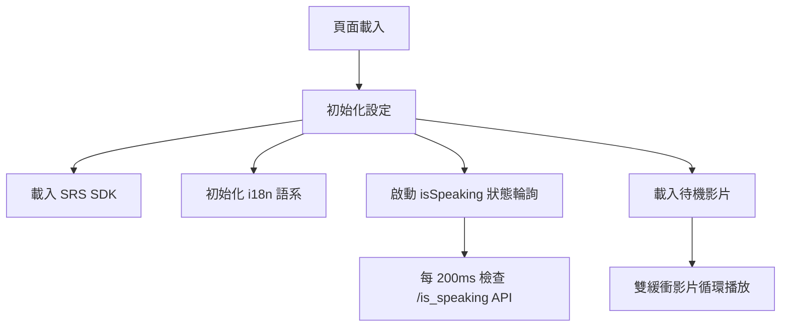

## 2. 用戶互動流程總覽

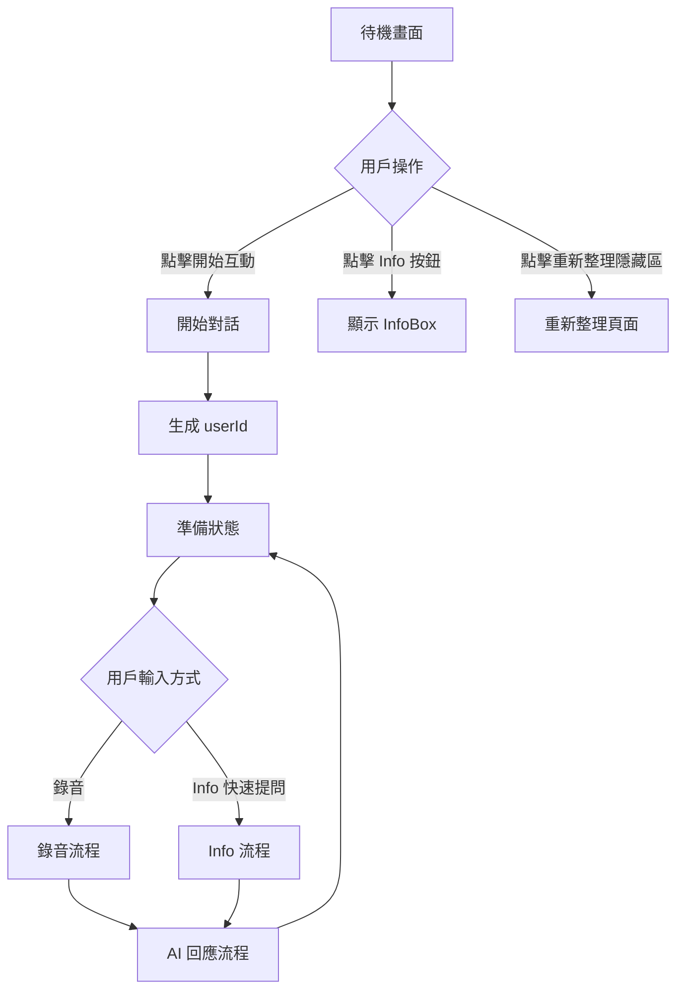

## 3. 錄音對話流程

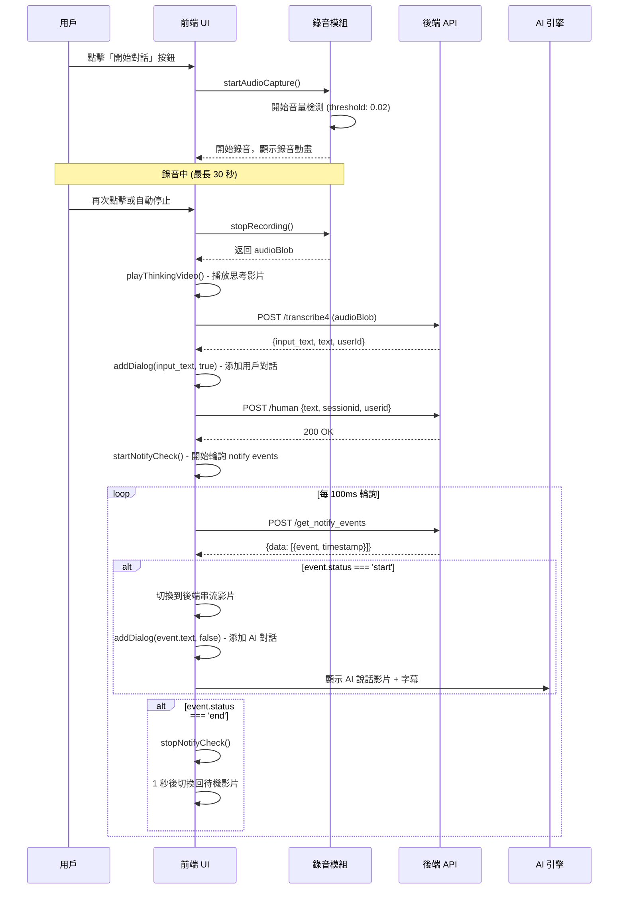

## 4. Info 按鈕流程（新優化機制）

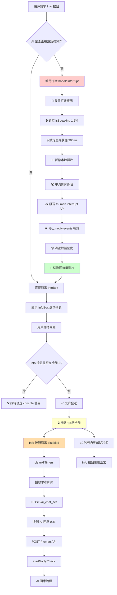

## 5. 打斷機制詳細流程

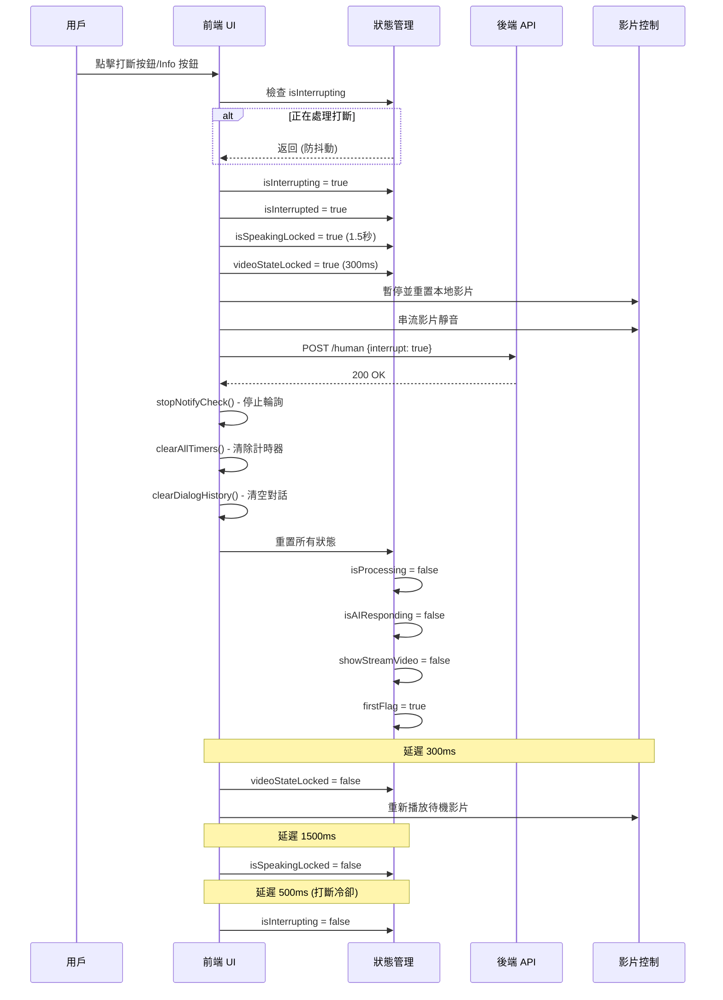

## 6. 冷卻機制對比圖

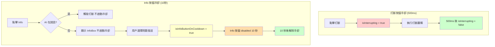

## 7. 狀態鎖定機制

```mermaid
gantt
    title 打斷操作後的狀態鎖定時間軸
    dateFormat X
    axisFormat %L ms

    section 打斷標記
    isInterrupted (永久直到下次操作) :done, 0, 2000

    section isSpeaking 鎖定
    isSpeakingLocked :crit, 0, 1500
    後端狀態可更新 :active, 1500, 2000

    section 影片狀態鎖定
    videoStateLocked :crit, 0, 300
    影片恢復控制 :active, 300, 2000

    section 打斷處理鎖定
    isInterrupting :crit, 0, 500
    可再次打斷 :active, 500, 2000
```

## 8. Notify Events 輪詢機制

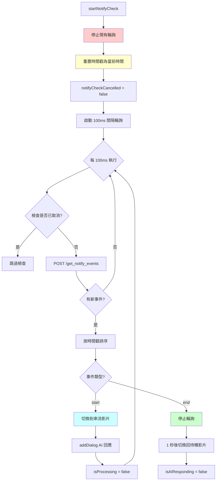

## 9. 雙緩衝影片播放機制

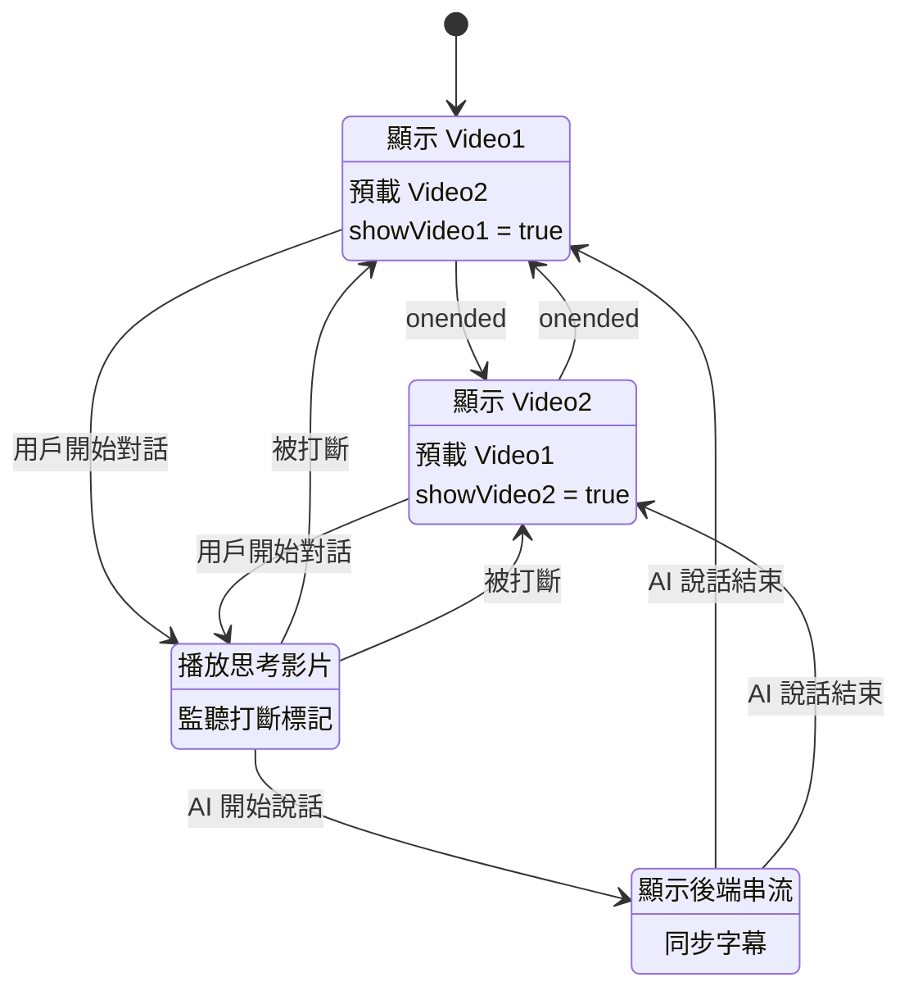

## 10. 完整用戶場景流程

### 場景 A: 正常對話流程

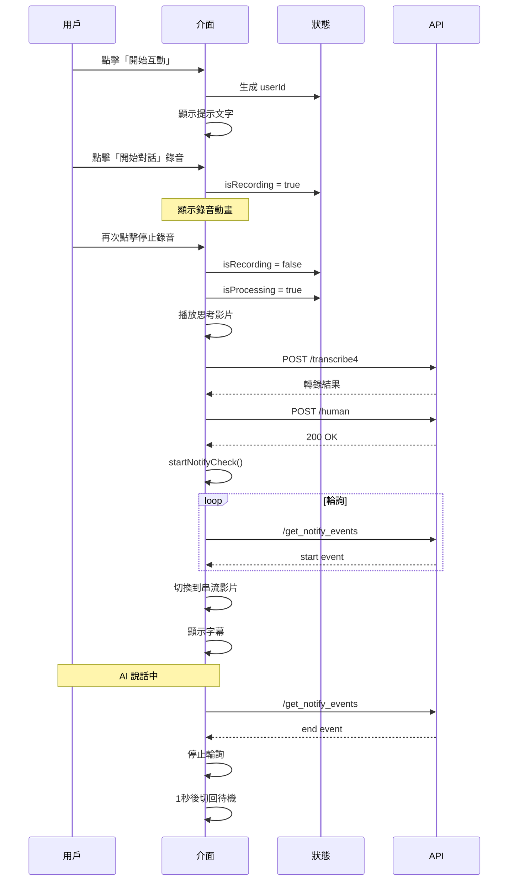

### 場景 B: 快速連續點擊 Info（防呆機制）

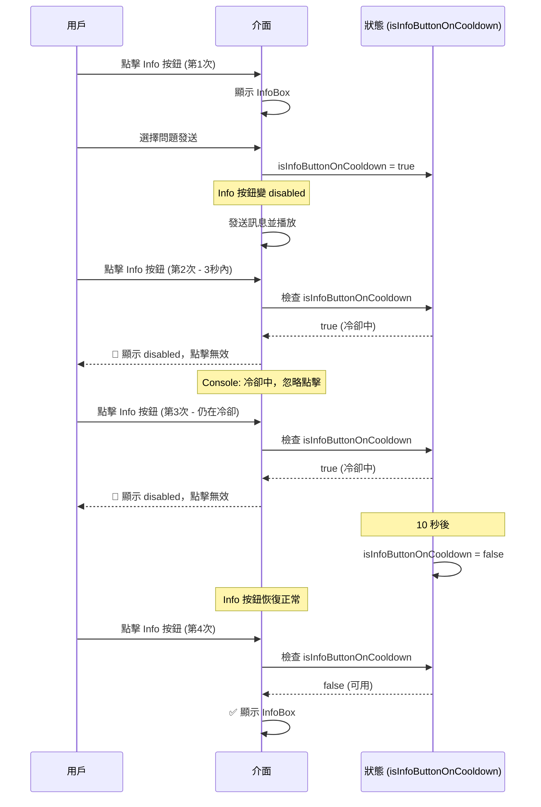

### 場景 C: AI 說話時打斷並切換話題

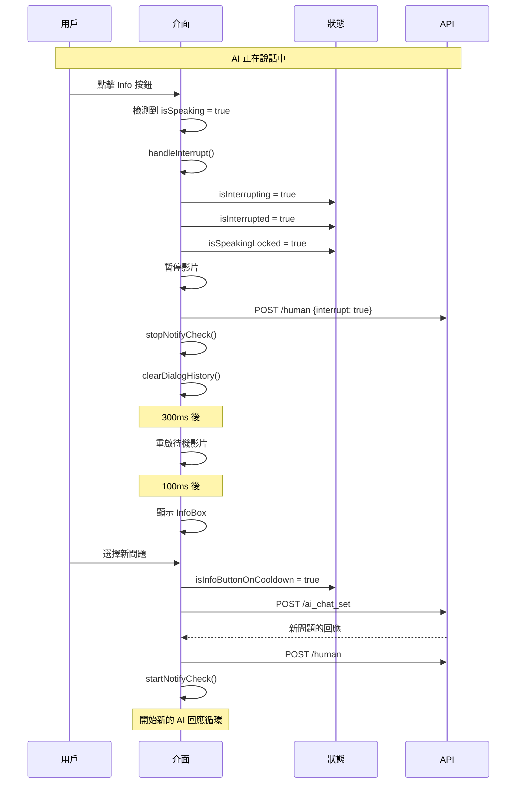

## 11. 錯誤處理流程

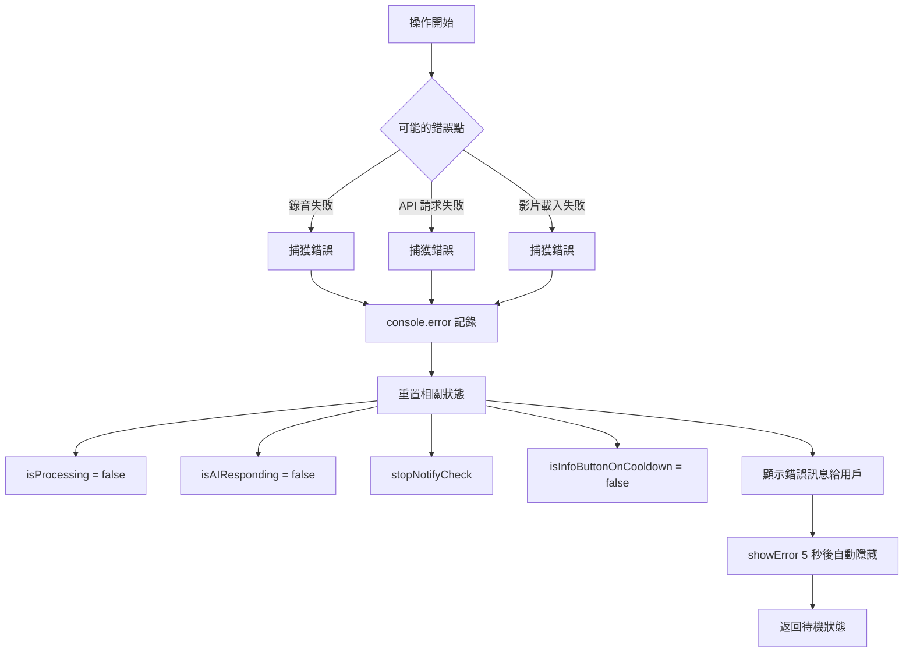

## 12. 主要狀態變數說明

| 狀態變數 | 用途 | 鎖定時間 |
|---------|------|---------|
| `isRecording` | 是否正在錄音 | - |
| `isProcessing` | 是否正在處理（思考影片） | - |
| `isAIResponding` | AI 是否正在回應 | - |
| `isSpeaking` | AI 是否正在說話 | - |
| `isSpeakingLocked` | 鎖定 isSpeaking 狀態 | 1.5 秒 |
| `isInterrupted` | 是否已被打斷 | 直到下次操作 |
| `isInterrupting` | 是否正在處理打斷 | 500ms |
| `videoStateLocked` | 鎖定影片狀態 | 300ms |
| `isInfoButtonOnCooldown` | Info 按鈕冷卻 | 10 秒 |
| `showStreamVideo` | 是否顯示串流影片 | - |
| `showInfoBox` | 是否顯示 InfoBox | - |

## 13. API 端點總覽

```mermaid
graph LR
    A[前端] --> B[/is_speaking - 每 200ms]
    A --> C[/transcribe4 - 語音轉文字]
    A --> D[/ai_chat_set - Info 文字訊息]
    A --> E[/human - 發送到 AI]
    A --> F[/get_notify_events - 每 100ms]
    A --> G[/get_current_config - 初始化]
    A --> H[/get_avatars - 取得角色]
    A --> I[/get_voices - 取得聲音]

    B --> J[https://talk-dev.aitago.tw]
    C --> K[https://talk-dev.aitago.tw:9880]
    D --> K
    E --> J
    F --> J
    G --> J
    H --> J
    I --> J
```

---

## 總結

此系統實現了完整的數位人對話功能，包含：

1. **錄音對話**：語音輸入 → 轉錄 → AI 回應
2. **快速提問**：Info 按鈕 → 預設問題 → AI 回應
3. **打斷機制**：隨時打斷 AI 說話，重置狀態
4. **冷卻防呆**：
   - Info 按鈕：10 秒冷卻，防止快速連續發送
   - 打斷按鈕：500ms 冷卻，防止過快連續打斷
   - **獨立計時**：互不干擾
5. **狀態管理**：多層鎖定機制確保狀態一致性
6. **影片同步**：雙緩衝 + 串流切換，流暢過渡
7. **錯誤處理**：完整的異常捕獲和狀態恢復

所有機制協同工作，提供流暢的用戶體驗。
